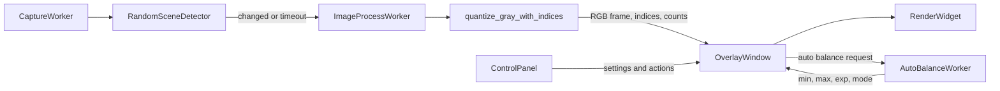

# ValueLens Pipeline

本文件描述 ValueLens 目前的即時處理資料流。整體採用非同步 worker 架構，將擷取、重度影像處理、自動平衡與 UI 繪製拆開，避免 UI 主執行緒被高解析度影像運算阻塞。

## 總覽



## 1. Capture Layer

主要檔案：

- `valuelens/core/capture_service.py`
- `valuelens/core/sources.py`
- `valuelens/core/engine.py`

執行緒：

- `CaptureWorker`

資料流：

1. `CaptureWorker` 從目前 `FrameContext` 取得擷取範圍。
2. `LiveScreenSource` 使用 `CaptureService` 擷取 contiguous BGR frame。Windows 上若已安裝 `bettercam` 會優先走 DXGI 類 backend，否則使用 `mss`。
3. live source 從 BGR 建立灰階圖，並將同一份 contiguous BGR frame 給後續 compute。
4. `RandomSceneDetector` 使用灰階圖做隨機採樣變動偵測。
5. 只有在畫面變動或達到 `sync_timeout_s` 時，才推送 frame 到 compute layer。

效能策略：

- `bettercam` 在 Windows 且已安裝時是優先擷取後端；`mss` 是穩定 fallback。
- 擷取 worker 具備保守 adaptive pacing：靜止畫面會降低 polling 頻率，畫面變動後恢復較高頻率。
- `scripts/benchmark_capture_pipeline.py` 可分段量測 `mss.grab`、buffer reshape、BGR materialize、gray conversion、scene detect。
- `VALUELENS_CAPTURE_BACKEND=mss|bettercam|auto` 可用來強制指定 backend，方便實測比較。

## 2. Compute Layer

主要檔案：

- `valuelens/core/engine.py`
- `valuelens/core/quantize.py`

執行緒：

- `ImageProcessWorker`

輸入：

- BGR frame
- `AppSettings`

輸出：

- RGB output frame
- quantized index map
- edge map
- pre-filter distribution counts
- compute time

`quantize_gray_with_indices()` 的主要步驟：

1. 建立 `FilterContext`。
2. 將輸入轉成 `original_gray`，並建立可被濾鏡修改的 `working_gray`。
3. 用量化 LUT 在濾鏡前計算 `true_counts`，讓分佈統計不被 blur/dither/edge/morph 污染。
4. 依照 `process_order` 執行濾鏡：
   - `blur`
   - `dither`
   - `edge`
   - `morph`
5. 對 `working_gray` 產生 quantized indices。
6. 使用 color LUT 將 indices 映射成 RGB output。

加速策略：

- `get_quantization_lut()` 快取目前量化 LUT。
- `get_color_lut_bgr()` 快取 color LUT。
- 若 `valuelens_native` 可用且條件適合，會使用 native color map。
- 若 native 不可用或目前條件需要 fallback，使用 Python / NumPy / OpenCV 路徑。

## 3. Balance Layer

主要檔案：

- `valuelens/core/balance.py`
- `valuelens/core/engine.py`
- `valuelens/ui/overlay_window.py`

執行緒：

- `AutoBalanceWorker`

概念：

- UI 使用 W:G:B preset 表示目標白/灰/黑比例。
- `balance.py` 會把不同 levels 的分佈折疊成 W:G:B。
- `optimize_balance_params()` 搜尋 `(min, max, exp, curve_mode)`，找出較接近目標比例的參數。

模式：

- Reset balance：
  - 使用原始畫面分佈。
  - 以 `(0, 255, 0.0)` 作為起點。
  - 可搜尋多種 curve mode。
- Auto continuous：
  - 使用降採樣影像。
  - 從目前參數出發。
  - 使用 hysteresis 與 UI 端 smoothing 降低閃爍。

責任邊界：

- `ControlPanel` 只發出 auto balance request。
- `OverlayWindow` 決定使用哪張圖、哪個 target、是否 search all modes。
- `AutoBalanceWorker` 在背景呼叫 `optimize_balance_params()`。
- 結果回到 `OverlayWindow` 後更新 UI 與設定。

## 4. UI Layer

主要檔案：

- `valuelens/ui/overlay_window.py`
- `valuelens/ui/control_panel.py`
- `valuelens/ui/render_widget.py`

職責：

- `OverlayWindow`：
  - 建立與管理 worker。
  - 接收 capture/compute/balance 結果。
  - 管理 freeze/image/compare mode。
  - 將最新 frame 交給 render widget。
- `ControlPanel`：
  - 提供 levels、curve mode、input/output range、filter parameters。
  - 管理 draggable filter order。
  - 管理 preset、startup preset、last state。
  - 發出所有使用者操作 signal。
- `RenderWidget`：
  - 繪製處理後畫面、對照畫面、分佈 overlay 與 UI overlay 元件。

## 5. Static Image / Freeze Flow

圖片模式或凍結模式會改用 `StaticImageSource`：

1. 來源影像存在記憶體中，不再使用 live screen capture。
2. 支援縮放與平移邏輯。
3. 仍走同一個 compute layer，因此量化、濾鏡、分佈與 auto balance 邏輯一致。

## 6. Native Acceleration

主要檔案：

- `valuelens/native/src/valuelens_native.cpp`
- `valuelens/core/quantize.py`

目前 native 模組提供：

- quantization smoke helper。
- distribution helper。
- `color_map_rgb(indices, lut_bgr)`：將 quantized indices 與 BGR LUT 轉為 RGB output。

原則：

- native 是可選加速。
- 載入失敗或不支援的情境會 fallback 到 Python。
- 新增 native 路徑時必須用 pytest 比對 pixel output 一致性。

## 7. Benchmark / Test Entry Points

測試：

```powershell
python -m pytest
python scripts\native_smoke.py
```

效能觀測：

```powershell
python scripts\benchmark_capture_pipeline.py
python scripts\benchmark_quantize.py
python scripts\benchmark_balance.py
```

Qt smoke / stress：

```powershell
$env:QT_QPA_PLATFORM='offscreen'; python scratch\self_check.py
$env:QT_QPA_PLATFORM='offscreen'; python scratch\ultimate_check.py
```
